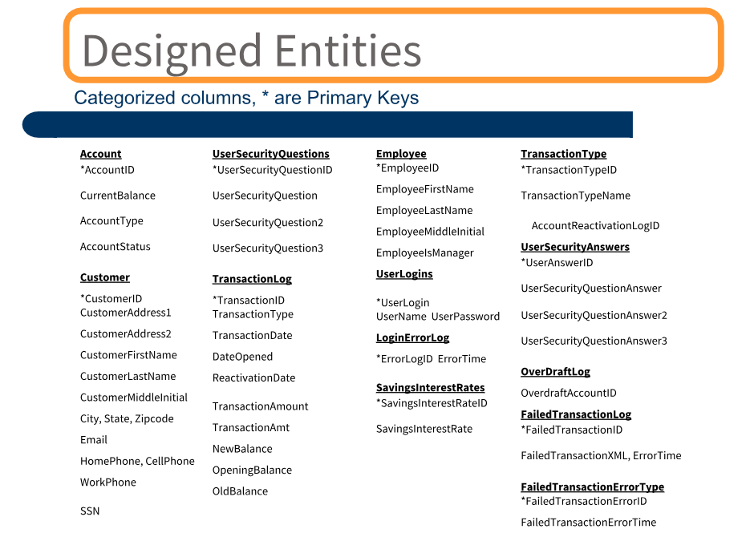

# Bank-Database-Design

### ER Diagram:

### Design Entities:

### Introduction:
There are only two types of accounts at this time: Checking and Savings accounts. The provided column list should be separated into appropriate entities (tables) with relationships between these entities defined. The most efficient choices as far as your primary key constraints and foreign key constraints, and picked the appropriate data types for each of the columns.

### Project Goals:
The goal of the project is to understand database entities in more depth and have practical experience of working with different objects of SQL.

### Phase I:
1.  Create a database for a banking application called “Bank”. 
2.  Create all the tables mentioned in the database diagram. 
3.  Create all the constraints based on the database diagram. 
4.  Insert at least 5 rows in each table.

### Phase II:
1.  Create a view to get all customers with checking account from ON province.
2.  Create a view to get all customers with total account balance (including interest rate) greater than 5000.
3.  Create a view to get counts of checking and savings accounts by customer.
4.  Create a view to get any particular user’s login and password using AccountId.
5.  Create a view to get all customers’ overdraft amount.
6.  Create a stored procedure to add “User_” as a prefix to everyone’s login (username).
7.  Create a stored procedure that accepts AccountId as a parameter and returns customer’s full name.
8.  Create a stored procedure that returns error logs inserted in the last 24 hours.
9.  Create a stored procedure that takes a deposit as a parameter and updates CurrentBalance value for particular account.
10. Create a stored procedure that takes a withdrawal amount as a parameter and updates CurrentBalance value for that account. 
11. Create a stored procedure to remove all security questions for a particular login. 
12. Delete all error logs created in the last hour.
13. Write a query to remove SSN column from Customer table.
14. Prepare a report to describe the project.
15. Prepare a presentation for the project.

